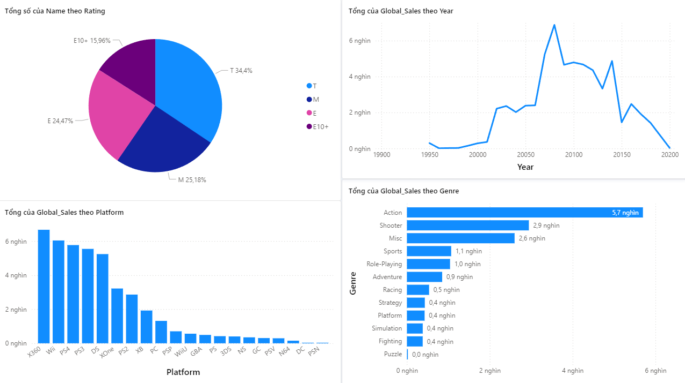
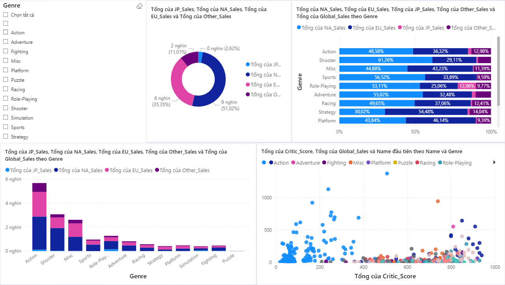
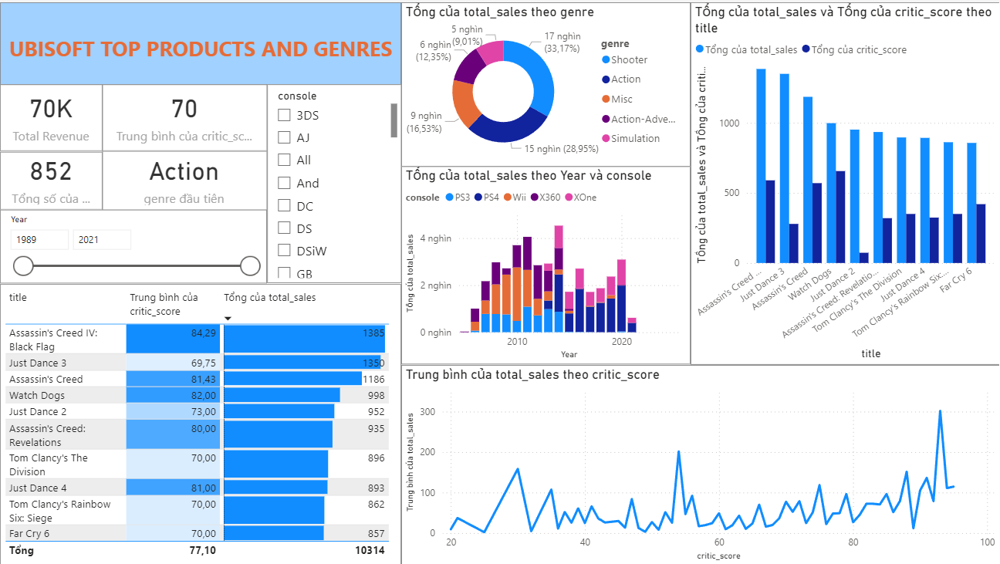
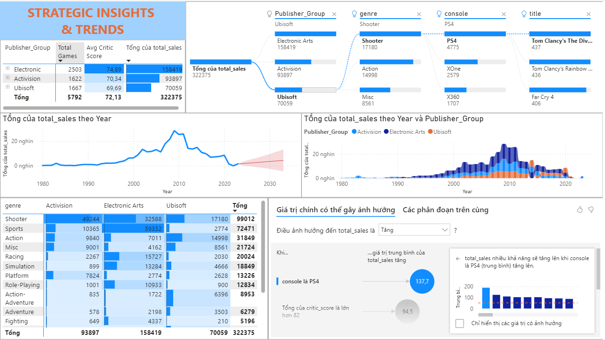
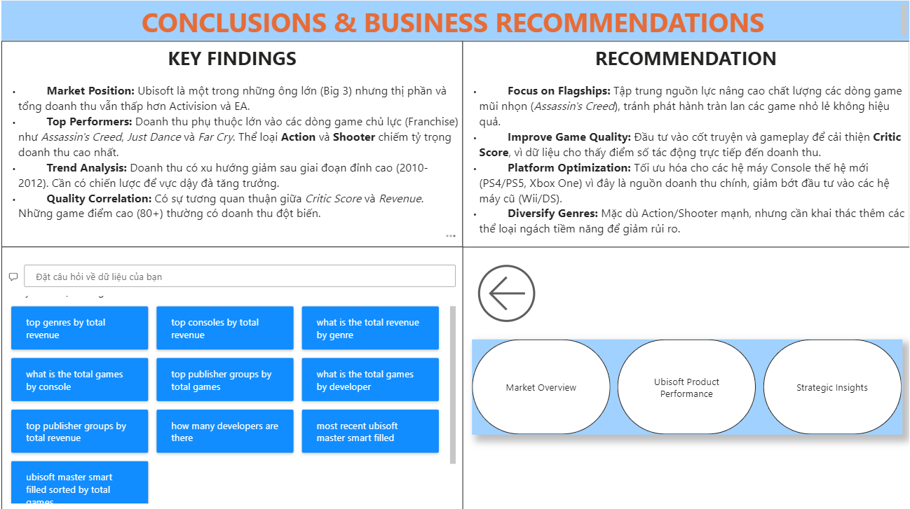

# 🎮 Ubisoft Business Intelligence: From Data Analysis to Sales Prediction

> **Thực hiện bởi:** **Nguyễn Phúc Minh Đăng (521H0497)**
>
> **Vai trò:** Data Analyst & Machine Learning Engineer

## 📖 Introduction (Giới thiệu)
Dự án **Business Intelligence (BI)** toàn diện về **Ubisoft Entertainment SA**.
Mục tiêu: Xây dựng hệ thống hỗ trợ ra quyết định (DSS) dựa trên dữ liệu lịch sử ngành game, đi từ phân tích khám phá (Descriptive) đến dự báo (Predictive) và đề xuất chiến lược (Prescriptive).

---

## 📍 Phase 1: Descriptive Analysis (Midterm)
Giai đoạn phân tích khám phá dữ liệu (EDA) sử dụng **Python** để làm sạch dữ liệu và tìm ra các xu hướng kinh doanh cốt lõi trong quá khứ.

> **Các biểu đồ phân tích chính:**
>
> | 1. Phân tích Xu hướng (Trend) | 2. Ma trận Tương quan (Correlation) |
> | :---: | :---: |
> |  |  |
> | *Biểu đồ thể hiện biến động doanh thu* | *Mức độ ảnh hưởng giữa các chỉ số* |

👉 *[Xem chi tiết Báo cáo Giữa kỳ (PDF)](Phase1_EDA_Analysis/Midterm_Report.pdf)*

---

## 📍 Phase 2: Predictive Modeling & Dashboard (Final)
Xây dựng mô hình Machine Learning dự báo doanh thu và hệ thống Dashboard quản trị chiến lược trên **Power BI**.

### 1. Machine Learning Performance
* **Model:** Gradient Boosting Regressor (Tối ưu nhất trong các mô hình thử nghiệm).
* **Target:** Dự báo doanh thu toàn cầu (`Global_Sales`).
* **Metric:** R² Score ~18.83% (Phản ánh thị trường game chịu ảnh hưởng lớn bởi xu hướng và marketing hơn là chỉ số kỹ thuật).

### 2. Power BI Dashboard System
Hệ thống báo cáo được thiết kế theo luồng kể chuyện (Data Storytelling) gồm 4 màn hình chi tiết:

#### 📊 1. Market Overview
> Tổng quan thị trường game toàn cầu, so sánh thị phần của Ubisoft với các đối thủ (EA, Activision...).

 

#### 📈 2. Ubisoft Product Performance
> Phân tích sâu hiệu suất kinh doanh của các dòng game chủ lực (Assassin's Creed, Far Cry...).

 

#### 🧠 3. Strategic Insights
> Phân tích hành vi người dùng, đánh giá (Critic/User Score) và các yếu tố ảnh hưởng đến doanh thu.

 

#### 🎯 4. Conclusion
> Tổng kết các chỉ số chính (KPIs) và đưa ra khuyến nghị chiến lược cho ban quản trị.
